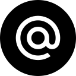

# 👋 Hello World!  Selma is here!

 

 

 ## More about me
 ❤️ Programming | 🖤 Travelling | 💙 Nature
 
I am a computer science engineer who graduated from Higher National Computer Science School known as ESI in Algeria. I am currently a full time student at Microverse, learning Full Stack Web Development. I like  collaborating with others to build digital solutions that solve real-world problems.

- 🌱   I’m currently learning Full Stack Development.
- 🛠   I’m currently working with HTML, CSS, SCSS, Ruby, Ruby on Rails, Javascript.
- 👯   I’m looking to collaborate on  REACT projects
- 👾   Fun fact: Equal is Not Always Equal in Javascript.
- 💬 Ask me about anything. I will try to help you as much as I can.
- ⚡ Quote: If you don't have any shadows, you're not standing in the light.
 
##  How about some stats ?

<h3>
  

    📈  &nbsp; My GitHub Stats
  
 
  
   

  

   

</h3>

<h2> Let's connect 👨‍💻 and forge the future together 😁✌   </h2> 

 

**Check the Repositories and don't forget to give a star ** 👇

⭐ From [Selma](https://github.com/selma-belhadj)
-------
<!--
**selma-belhadj/selma-belhadj** is a ✨ _special_ ✨ repository because its `README.md` (this file) appears on your GitHub profile.

Here are some ideas to get you started:

- 🔭 I’m currently working on ...
- 🌱 I’m currently learning ...
- 👯 I’m looking to collaborate on ...
- 🤔 I’m looking for help with ...
- 💬 Ask me about ...
- 📫 How to reach me: ...
- 😄 Pronouns: ...
- ⚡ Fun fact: ...
-->
